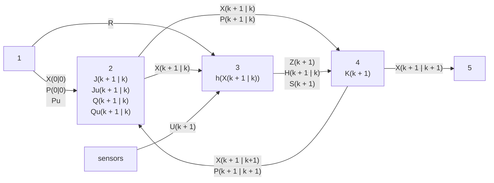

# MTRN4010 Project

## Data Legend

- `table` [3x3068 uint32]: table of events
    - `1`: timestamp
    - `2`: index
    - `3`: type data
- `vw` [2x2337 single]: Speed encoder and gyro data.
- `scans` [321x731 uint16]: LiDAR ranges with each pass.
- `verify` [1x1 struct]:
    - `poseL` [3x731 single]: Truth for verification of platform poses over time (10 ms sampling).
- `pose0` [3x1 single]: Initial platform pose (m, m, rad).
- `n` 3068: number of events
- `LidarCfg` [1x1 struct]: Info about LiDAR installation.
    - `Lx`: 0.4000.
    - `Ly`: 0.
    - `Alpha`: 0.
- `Walls` [2x38 single]: Truth for verification of walls.
- `Landmarks` [2x26 single]: Truth for verification of landmarks.

## Jacobian Matrix

A few interpretations:
1. The derivative of $f$ at $x$ is equivalent to the Jacobian of $f$ at $x$ if $f$ and $x$ are multi-dimensional.

2. The Jacobian matrix is a generalisation of all of the first-order partial derivatives of a function, $f: \reals^{N} \rightarrow \reals^{M}$, with respect to a given point, $x$:
$$
J = \left( \frac{\partial f}{\partial x_{1}} \; ... \; \frac{\partial f}{\partial x_{n}} \right) =
\left(
    \begin{matrix}
        \frac{\partial f_{1}}{\partial x_{1}} & ... & \frac{\partial f_{1}}{\partial x_{n}} \\
        \vdots & \ddots & \vdots \\
        \frac{\partial f_{m}}{\partial x_{1}} & ... & \frac{\partial f_{m}}{\partial x_{n}}
    \end{matrix}
    \right)
$$

3. The Jacobian matrix can be visualised as a vector of gradients with respect to each dimension of $f$ at a point.

4. The Jacobian matrix represents the differential of $f$ at every point where $f$ is differentiable.

5. The Jacobian matrix describes an amount of "stretching", "rotating", or "transforming" of a function locally near a point.

## Covariance

The covariance is a measure of direction of the relationship between two variables:
$$
cov(X, Y) = E\left( \left(X - E(X)\right) \left(Y - E(Y)\right) \right)
$$

## Covariance Matrix

The covariance matrix is the covariance between each pair of elements of a random vector.

Let $X$ be a random vector and the covariance of $X$ is:
$$
cov(X) = E\left( \left(X  - E(X)\right) \left(X  - E(X)\right)^{T} \right)
$$

Suppose the random vector, $X$, is linearly transformed into a random vector, $X$, by some matrix, $G$:
$$
Y = GX
$$

The covariance matrix of $Y$ is then:
$$
\begin{aligned}
cov(Y) &= E\left( \left(Y - E(Y)\right) \left(Y - E(Y)\right)^{T} \right) \\
&= E\left( \left(GX - E(GX)\right) \left(GX - E(GX)\right)^{T} \right) \\
&= E\left( G\left(X - E(X)\right) \left(X - E(X)\right)^{T}G^{T} \right) \\
&= G \cdot E\left( \left(X - E(X)\right) \left(X - E(X)\right)^{T} \right) \cdot G^{T} \\
&= G \cdot cov(X) \cdot G^{T} \\
\end{aligned}
$$

> Note that G does not have to be a Jacobian matrix.

## EKF Algorithm

### 1. Get Initial Values

We are given some standard deviations:
$$
\begin{aligned}
sd_{x} &=& 0 \; ms^{-1} &\text{ : standard deviation of x in global coordinate frame} \\
sd_{y} &=& 0 \; ms^{-1} &\text{ : standard deviation of y in global coordinate frame} \\
sd_{\phi} &=& 0 \; ms^{-1} &\text{ : standard deviation of heading in global coordinate frame} \\
sd_{speed} &=& 0.05 \; ms^{-1} &\text{ : standard deviation of velocity measurement} \\
sd_{gyro} &=& 1 \; degree \; s^{-1} &\text{ : standard deviation of gyroscope measurement} \\
sd_{range} &=& 0.1 \; ms^{-1} &\text{ : standard deviation of range observation} \\
sd_{bearing} &=& 2 \; degree \; s^{-1} &\text{ : standard deviation of bearing observation} \\
\end{aligned}
$$

We use the standard deviations to make our initial covariance matrices:
$$
\begin{aligned}
P(0 | 0) &=&
\left(
    \begin{matrix}
        sd_{x}^{2} & 0 & 0 \\
        0 & sd_{y}^{2} & 0 \\
        0 & 0 & sd_{\phi}^{2} \\
    \end{matrix}
\right) &\text{ : covariance matrix of states} \\\\
Pu(\forall k) &=&
\left(
    \begin{matrix}
        sd_{speed}^{2} & 0 \\
        0 & sd_{gyro}^{2} \\
    \end{matrix}
\right) &\text{ : covariance matrix of input noise} \\\\
R(\forall k) &=&
\left(
    \begin{matrix}
        sd_{range}^{2} & 0 \\
        0 & sd_{bearing}^{2} \\
    \end{matrix}
\right) &\text{ : covariance matrix of observation model noise}
\end{aligned}
$$

We can determine:
$$
\begin{aligned}
X &=& \left(\begin{matrix} x \\ y \\ \phi \end{matrix}\right) &\text{ : states vector} \\
\end{aligned}
$$

The initial value of the states is obtained from `data.pose0`.

### 2. Predict Next State

We first need to calculate the Jacobian matrices for the linear transformation from the current to next state given the current state and current input:
$$
\begin{aligned}
J(k + 1 | k) &=&
\left(
    \begin{matrix}
        1 & 0 & -dt \cdot v\cdot sin(\phi) \\
        0 & 1 & dt \cdot v \cdot cos(\phi) \\
        0 & 0 & 1 \\
    \end{matrix}
\right) &\text{ : Jacobian matrix of process model given a state} \\\\
Ju(k + 1 | k) &=&
\left(
    \begin{matrix}
        dt \cdot cos(\phi) & 0 \\
        dt \cdot sin(\phi) & 0 \\
        0 & dt \\
    \end{matrix}
\right) &\text{ : Jacobian matrix of process model given an input}
\end{aligned}
$$

The Jacobian matrices can be calculated when the linear velocity and heading has been updated.

> Why do we use the process model as our function of the Jacobian matrix? Because it is the function that maps the current state to the next state.

> Why do we need both Jacobian matrices? Because our covariance of states is affected by the state and inputs. If we wanted our covariance of the next state to be more accurate then we can factor in skid, etc.

Calculate the expected value of the state in the next time step:
$$
\begin{aligned}
X(k + 1 | k) &= J(k + 1 | k)) X(k | k) &\text{ : next state predicted from current state} \\
\end{aligned}
$$

Calculate the covariance matrix of the state in the next time step:
$$
\begin{aligned}
Q &=& J(k + 1 | k) P(k | k) J(k + 1 | k)^{T} &\text{ : next covariance matrix of state predicted from current} \\
Qu &=& Ju(k + 1 | k) Pu(k | k) Ju(k + 1 | k)^{T} &\text{ : next covariance matrix of input noise predicted from current} \\
P(k + 1 | k) &=& Q + Qu &\text{ : next covariance matrix of state factoring in noise}
\end{aligned}
$$

The expected value of the next state and the covariance matrix of the next state can be calculated after the Jacobian matrices.

### 3. Get Innovation

The innovation is the difference between the observed value of a variable and prediction of the variable based on the predicted next state.

> Note that the variable could be anything that we can observe and predict.

$$
\begin{aligned}
U(k + 1) &=& \left(\begin{matrix} r \\ \alpha \end{matrix}\right) &\text{ : true observation} \\\\
h(X(k + 1 | k)) &=& \left(\begin{matrix} r \\ \alpha \end{matrix}\right) = \left(\begin{matrix} \sqrt{(x - x_{k})^{2} + (y - y_{k})^{2}} \\ atan2(y_{k} - y, x_{k} - x) - \phi \end{matrix}\right) &\text{ : predicted observation} \\\\
Z(k + 1) &=& U(k + 1) - h(X(k + 1 | k)) &\text{ : innovation}
\end{aligned}
$$

The true observation is obtained from `data.Landmarks`. The predicted observation is obtained from processing `data.scans` with the state when the trilateration and triangulation is performed.

The innovation is calculated after the data association step between the true and predicted observations.

> Why do we need the innovation? Because it is used to tune the predicted state vector closer to its true value.

Now calculate the innovation covariance:
$$
\begin{aligned}
H(k + 1 | k) &=& \left. \frac{\partial h}{\partial x} \right|_{x = X(k + 1 | k)} =
\left(
    \begin{matrix}
        \frac{x - x_{k}}{\sqrt{(x - x_{k})^{2} + (y - y_{k})^{2}}} & \frac{y - y_{k}}{\sqrt{(x - x_{k})^{2} + (y - y_{k})^{2}}} & 0
    \end{matrix}
\right) &\text{ : Jacobian matrix of observation model given a state} \\\\
S(k + 1) &=& H(k + 1)P(k + 1 | k)H(k + 1)^{T} + R(k + 1) &\text{ : innovation covariance}
\end{aligned}
$$

> Why do we use the observation model as our function of the Jacobian matrix? Because it is the function that maps the state to the observation.

Reminder that $R$ was calculated in our initial value step. It is added to the innovation covariance because $R$ is the covariance of the noise in the observation model.

### 4. Kalman Filter

The Kalman gain determines how much we need to correct our prediction of the states.
$$
\begin{aligned}
K(k + 1) &= P(k + 1 | k) \cdot H(k + 1)^{T} \cdot S(k + 1)^{-1} &\text{ : Kalman gain}
\end{aligned}
$$

With the Kalman gain, the updated state and covariance matrix of the state of the next step is:
$$
\begin{aligned}
X(k + 1 | k + 1) = X(k + 1 | k) + K(k + 1) \cdot Z(k + 1) &\text{ : updated state vector} \\
P(k + 1 | k + 1) = (I - K(k + 1) \cdot H(k + 1)) \cdot P(k + 1 | k) &\text{ : updated covariance matrix of state}
\end{aligned}
$$

The updated state and covariance matrix of the state is fed-back into the EKF algorithm to make the next prediction.

### 5. Get Output

The output is the updated state vector, $X(k + 1 | k + 1)$.

### EKF Flowchart

